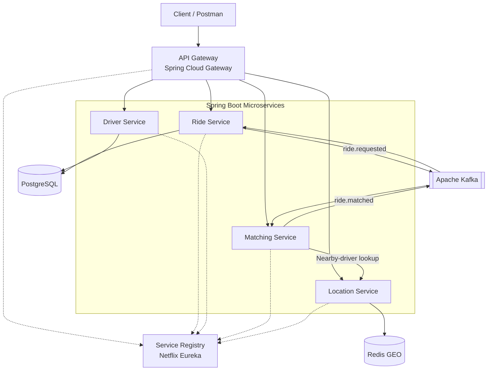
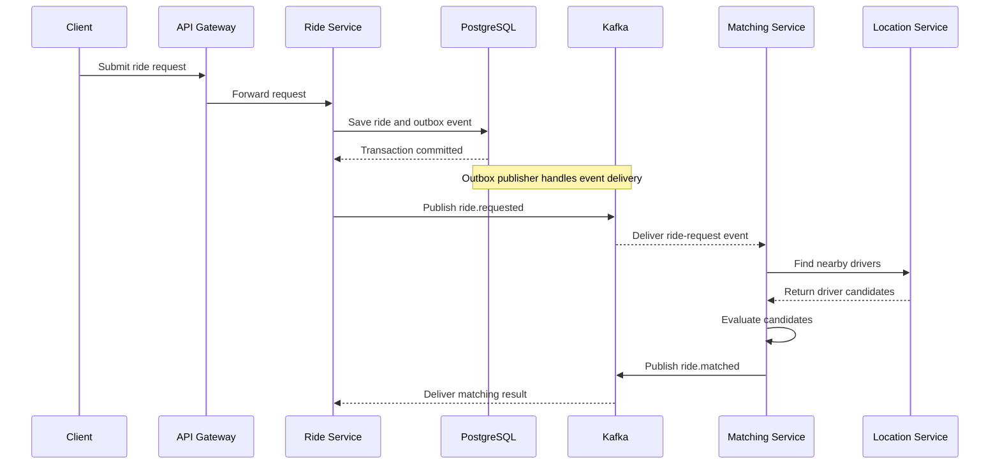
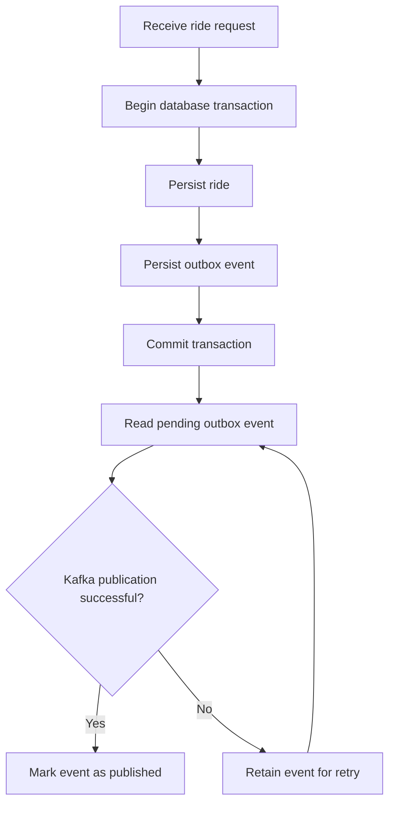

# 🚗 Ride Booking Backend

A **Java Spring Boot microservices-based ride-booking backend** designed to explore scalable backend architecture, event-driven communication, driver matching, and fault tolerance.

The project started with three core services — Ride Service, Matching Service, and Location Service — and was extended with Driver Service, service discovery, an API Gateway, and reliability mechanisms for distributed communication.

Beyond implementing core ride-booking functionality, this project explores how backend systems handle service failures, duplicate events, geospatial queries, and consistency between database transactions and asynchronous event publication.

**Project status:** In Progress

**Repository:** [Ride_Application_Backend](https://github.com/Aman1807-coder/Ride_Application_Backend)

---

## 📑 Table of Contents

- [Overview](#-overview)
- [Key Features](#-key-features)
- [Architecture](#-architecture)
- [Microservices](#-microservices)
- [Ride Request Workflow](#-ride-request-workflow)
- [Driver Matching Strategy](#-driver-matching-strategy)
- [Resilience and Fault Tolerance](#-resilience-and-fault-tolerance)
- [Kafka Reliability](#-kafka-reliability)
- [Technology Stack](#-technology-stack)
- [Prerequisites](#-prerequisites)
- [Local Setup](#-local-setup)
- [API Reference](#-api-reference)
- [Testing with Postman](#-testing-with-postman)
- [Engineering Concepts Explored](#-engineering-concepts-explored)
- [Future Improvements](#-future-improvements)
- [Contributing](#-contributing)
- [Author](#-author)

---

## 🎯 Overview

This application models the backend of a ride-booking platform using independently organized Spring Boot microservices.

The architecture separates ride management, driver management, geolocation, and driver matching into dedicated services. It combines synchronous HTTP communication with asynchronous Kafka events to support a distributed ride-request workflow.

The project has been extended beyond the original tutorial to explore additional backend engineering concepts, including:

- Service discovery and centralized API routing.
- Geospatial driver lookup using Redis GEO.
- Distance-aware driver matching.
- Resilience patterns for handling downstream failures.
- Kafka consumer failure handling through Dead Letter Topics.
- Idempotent message processing.
- Reliable event publication using the Transactional Outbox Pattern.

The goal is to understand not only how to build microservices, but also how to handle failures and data consistency across service boundaries.

## ✨ Key Features

### Microservices Architecture
- Dedicated services for rides, drivers, locations, and matching.
- Service registration and discovery using Netflix Eureka.
- Centralized request routing through Spring Cloud Gateway.
- Service-to-service HTTP communication using Spring Cloud OpenFeign.

### Driver Discovery and Matching
- Geospatial driver lookup using Redis GEO.
- Nearby-driver searches based on geographic coordinates and search radius.
- Distance-aware driver matching.
- Matching score based on distance (70%) and driver rating (30%).

### Resilience and Fault Tolerance
- Circuit Breaker using Resilience4j.
- Retry for handling transient failures.
- Rate Limiter for controlling request throughput.
- Fallback handling for downstream service failures.

### Kafka Reliability
- Event-driven communication using Apache Kafka.
- Dead Letter Topic (DLT) handling for failed message processing.
- Idempotent message processing to prevent duplicate business operations.
- Transactional Outbox Pattern for reliable database-to-Kafka event publication.

### Persistence and Infrastructure
- PostgreSQL for relational application data.
- Redis for geospatial driver lookup.
- Docker-based local infrastructure.
- Maven multi-module project structure.

---

## 🏗 Architecture

The application consists of six main application services and supporting infrastructure.



### Architecture Overview

- **API Gateway:** Provides a centralized entry point for incoming HTTP requests.
- **Service Registry:** Enables services to register themselves and discover other services dynamically.
- **Ride Service:** Manages ride requests and participates in the ride lifecycle.
- **Driver Service:** Handles driver-related information and availability operations.
- **Location Service:** Maintains driver geolocation data and supports nearby-driver queries.
- **Matching Service:** Consumes ride-request events, retrieves nearby drivers, and evaluates matching candidates.
- **PostgreSQL:** Stores relational application data and outbox records.
- **Redis GEO:** Supports geospatial lookup of drivers.
- **Apache Kafka:** Enables asynchronous communication between services.

The diagram illustrates the logical architecture. Exact persistence ownership, gateway routes, and event-consumer mappings should be verified against the current service configuration.

---

## 🧩 Microservices

| Service | Responsibility |
|---|---|
| **API Gateway** | Centralized HTTP request routing to backend services. |
| **Service Registry** | Service registration and discovery using Netflix Eureka. |
| **Ride Service** | Ride requests, ride retrieval, and ride lifecycle operations. |
| **Driver Service** | Driver information and availability management. |
| **Location Service** | Driver location updates and nearby-driver lookup using Redis GEO. |
| **Matching Service** | Ride-request event consumption, candidate evaluation, and matching-result publication. |

### Communication Patterns

**Synchronous communication**
- HTTP-based service-to-service calls.
- Spring Cloud OpenFeign for declarative HTTP clients.
- Eureka-based service discovery.

**Asynchronous communication**
- Apache Kafka for ride-related events.
- Decoupled processing between the Ride Service and Matching Service.

This combination allows the application to explore when request-response communication is appropriate and when asynchronous messaging is useful.

---

## 🔄 Ride Request Workflow

The ride-request workflow uses Kafka to decouple ride creation from driver matching.

1. **Ride request:** The client submits a ride request through the API Gateway.
2. **Database transaction:** The Ride Service persists the ride and its outbox event in the same database transaction.
3. **Event publication:** The outbox publisher sends the pending ride-request event to Kafka.
4. **Event consumption:** The Matching Service consumes the `ride.requested` event.
5. **Driver discovery:** The Matching Service calls the Location Service to retrieve nearby driver candidates.
6. **Candidate evaluation:** Candidates are evaluated using the matching strategy.
7. **Matching result:** The Matching Service publishes a `ride.matched` event.
8. **Failure handling:** Messages that exhaust the configured processing-error handling policy can be routed to the relevant Dead Letter Topic.



The outbox mechanism provides a reliable way to coordinate database persistence and eventual event publication. PostgreSQL and Kafka are not treated as one atomic transaction.

---

## 📍 Driver Matching Strategy

The application extends the original matching workflow by considering the distance between potential drivers and the ride's pickup location.

### Geospatial Lookup with Redis GEO

Redis GEO is used to support nearby-driver searches based on geographic coordinates and a configurable search radius.

The Location Service exposes the following endpoint:

```http
GET /api/v1/locations/drivers/nearby?latitude={latitude}&longitude={longitude}&radius={radius}
```

The radius is expressed in kilometers. For example, setting `radius` to `5.0` requests a search within 5 km of the supplied coordinates.

### Matching Score

The matching strategy combines driver distance and driver rating.

| Factor | Weight |
|---|---:|
| Distance | 70% |
| Driver rating | 30% |

Distance has the greater influence on the matching score, while driver rating provides an additional selection factor.

The actual score depends on the implementation's normalization and ranking logic.

---

## 🛡 Resilience and Fault Tolerance

Distributed services can experience network failures, slow responses, unavailable dependencies, and temporary overload. This project explores several resilience patterns using Resilience4j.

### 1. Circuit Breaker

The Circuit Breaker monitors failures and can temporarily prevent calls to an unhealthy downstream service.

Its three standard states are:

- **CLOSED:** Calls are permitted normally.
- **OPEN:** Calls are short-circuited while the dependency is considered unhealthy.
- **HALF_OPEN:** A limited number of calls test whether the dependency has recovered.

The project uses this pattern to handle failures in downstream service communication, including location lookup.

### 2. Retry

Retry allows an operation to be attempted again when selected failures occur.

It is useful for transient errors, but retry policies must be configured carefully to avoid increasing load during an outage.

### 3. Rate Limiter

Rate Limiting restricts the number of permitted calls within a configured interval.

This can help control request throughput and protect resources from excessive traffic.

### 4. Fallback Handling

Fallback logic provides an alternative execution path when a protected operation fails.

A fallback does not necessarily mean the requested business operation succeeded. The application must still handle unavailable data and unsuccessful operations correctly.

### How These Patterns Work Together

| Pattern | Purpose |
|---|---|
| Circuit Breaker | Reduce calls to an unhealthy dependency. |
| Retry | Recover from selected transient failures. |
| Rate Limiter | Control request throughput. |
| Fallback | Handle failures through an alternative path. |

These patterns solve different problems. Their behavior depends on configuration, exception classification, retry ordering, and circuit-breaker metrics.

---

## 📨 Kafka Reliability

The project explores three important mechanisms for making asynchronous event processing more reliable: Dead Letter Topics, idempotency, and the Transactional Outbox Pattern.

### 1. Dead Letter Topic (DLT)

A Dead Letter Topic provides a destination for messages that cannot be processed successfully after the configured error-handling policy has been exhausted.

The project includes DLT handling for Kafka message-processing failures.

Benefits include:

- Separating repeatedly failing messages from normal processing.
- Retaining failed-message information for investigation.
- Supporting controlled recovery and reprocessing.

The configured event topics include:

| Topic | Purpose |
|---|---|
| `ride.requested` | Carries ride-request events. |
| `ride.matched` | Carries matching-result events. |
| `ride.requested-dlt` | Handles failed processing for the ride-request event flow. |

DLT routing depends on the configured Kafka error handler and retry policy. A message in a DLT is not automatically processed successfully or restored to the original workflow.

### 2. Idempotent Message Processing

Kafka consumers may receive the same logical event more than once. A consumer should not assume that each delivery represents a new business operation.

The project implements idempotency handling, including processed-ride tracking in the Matching Service.

The goal is to prevent repeated processing of the same logical ride event from creating duplicate business effects.

Idempotency depends on how event identity and processing state are persisted and checked. It complements Kafka delivery semantics rather than automatically providing end-to-end exactly-once processing.

### 3. Transactional Outbox Pattern

The Transactional Outbox Pattern addresses the **dual-write problem**: saving business data in a database and publishing a corresponding event to Kafka are two separate operations.

Without an outbox, a failure could produce this situation:

1. A ride is saved successfully in PostgreSQL.
2. The application attempts to publish the event to Kafka.
3. Kafka is unavailable, and publication fails.
4. The ride exists in the database, but downstream services never receive its event.

The outbox approach changes the workflow:

1. Save the ride and its outbox event within the same database transaction.
2. Commit the transaction.
3. Publish pending outbox events to Kafka.
4. Mark events as published after successful delivery.



The project implements and tests the outbox workflow.

**Important:** The outbox makes the ride and outbox-record writes atomic within PostgreSQL, but it does not make PostgreSQL and Kafka one atomic transaction. Duplicate publication can still occur, which is why idempotent consumer processing remains important.

---

## 🛠 Technology Stack

| Technology | Purpose |
|---|---|
| Java 25 | Programming language |
| Spring Boot 4.x | Application framework |
| Spring Cloud 2025.1.x | Microservices integration |
| Spring Cloud Gateway | API Gateway and request routing |
| Netflix Eureka | Service registration and discovery |
| Spring Cloud OpenFeign | Declarative HTTP communication |
| Apache Kafka | Asynchronous event-driven communication |
| PostgreSQL | Relational data persistence |
| Redis GEO | Geospatial driver lookup |
| Resilience4j | Circuit Breaker, Retry, and Rate Limiter |
| Maven | Build and dependency management |
| Docker | Local infrastructure |
| Postman | HTTP API testing |

The application uses a Maven multi-module structure. Verify the root POM and module-specific POM files for the exact dependency versions and compatibility requirements.

---

## ⚙️ Prerequisites

Before running the project, ensure the following are available:

- Java 25.
- IntelliJ IDEA.
- Docker.
- PostgreSQL, Redis, and Kafka running locally through Docker.
- Maven support through IntelliJ IDEA or an installed Maven distribution.
- Postman for API testing.

### Version Compatibility

Spring Boot, Spring Cloud, Java, and individual dependencies must use compatible versions. Review the project's Maven configuration before upgrading any component.

---

## 🚀 Local Setup

The project is developed and run locally through IntelliJ IDEA, with PostgreSQL, Redis, and Kafka running in Docker.

### 1. Clone the Repository

```bash
git clone https://github.com/Aman1807-coder/Ride_Application_Backend.git
cd Ride_Application_Backend
```

### 2. Start the Infrastructure

Start the PostgreSQL, Redis, and Kafka containers using the Docker configuration available in your environment.

Verify that:

- PostgreSQL is reachable from services that use it.
- Redis accepts connections from the Location Service.
- Kafka is reachable by the configured producers and consumers.
- Required Kafka topics are available or can be created according to the application configuration.

The project has used the local Kafka bootstrap address `localhost:9092`.

### 3. Configure Application Properties

Review each service's `application.properties` or `application.yml`.

Configure the values required by your local environment, including:

- PostgreSQL connection URL, username, and password.
- Redis host and port.
- Kafka bootstrap server and consumer settings.
- Eureka server URL.
- Service ports and gateway routes.

Keep credentials in local configuration or environment variables. Never commit real passwords, tokens, or other secrets to GitHub.

### 4. Build the Maven Project

Open the project in IntelliJ IDEA and import the root `pom.xml` as a Maven project.

Build the parent project and modules using IntelliJ's Maven tool window.

Alternatively, if Maven is available in your terminal:

```bash
mvn clean install
```

If the repository includes a Maven Wrapper, you can use the wrapper scripts instead.

### 5. Start the Services

A useful startup sequence is:

1. Start the Service Registry (Eureka).
2. Start the Ride Service, Driver Service, Location Service, and Matching Service.
3. Start the API Gateway.

Make sure the infrastructure is available and the service configurations are correct.

### 6. Verify the Application

- Check the service logs for successful startup.
- Verify service registration in Eureka.
- Confirm that the API Gateway can route requests to the intended services.
- Check Kafka producer and consumer logs during ride requests.
- Verify that Redis GEO operations return expected driver candidates.

---

## 🧪 API Reference

All endpoints below are accessed through the API Gateway at:

```text
http://localhost:8080
```

The `{rideId}`, `{driverId}`, `{latitude}`, `{longitude}`, and `{radius}` values are placeholders. Replace them with appropriate values when making requests.

### 1. Ride APIs

| Method | Endpoint | Description |
|---|---|---|
| `POST` | `/api/v1/rides/request` | Request a new ride. |
| `GET` | `/api/v1/rides/{rideId}` | Retrieve a ride by ID. |
| `POST` | `/api/v1/rides/{rideId}/start` | Start a ride. |
| `POST` | `/api/v1/rides/{rideId}/complete` | Complete a ride. |
| `POST` | `/api/v1/rides/{rideId}/cancel` | Cancel a ride. |

#### Request a Ride

**Endpoint**

```http
POST http://localhost:8080/api/v1/rides/request
Content-Type: application/json
```

**Request body**

```json
{
  "riderId": "rider:1",
  "pickupLatitude": "<pickupLatitude>",
  "pickupLongitude": "<pickupLongitude>",
  "pickupAddress": "<pickupAddress>",
  "dropLatitude": "<dropLatitude>",
  "dropLongitude": "<dropLongitude>",
  "dropAddress": "<dropAddress>"
}
```

Replace the coordinate placeholders with numeric JSON values and the address placeholders with strings.

#### Get Ride Details

```http
GET http://localhost:8080/api/v1/rides/{rideId}
```

Replace `{rideId}` with the ID of an existing ride.

#### Start a Ride

```http
POST http://localhost:8080/api/v1/rides/{rideId}/start
```

#### Complete a Ride

```http
POST http://localhost:8080/api/v1/rides/{rideId}/complete
```

#### Cancel a Ride

```http
POST http://localhost:8080/api/v1/rides/{rideId}/cancel
```

Use an existing ride ID and follow the application's valid ride-state transitions.

### 2. Driver APIs

| Method | Endpoint | Description |
|---|---|---|
| `POST` | `/api/v1/drivers/add` | Add a driver. |
| `GET` | `/api/v1/drivers/{driverId}` | Retrieve driver details by ID. |
| `PUT` | `/api/v1/drivers/update/availability` | Update driver availability and location. |

#### Add a Driver

**Endpoint**

```http
POST http://localhost:8080/api/v1/drivers/add
Content-Type: application/json
```

**Request body**

```json
{
  "name": "<driverName>",
  "vehicleNumber": "<vehicleNumber>",
  "phoneNumber": "<phoneNumber>",
  "drivingLicenseId": "<drivingLicenseId>"
}
```

Use fictional values for demonstration and testing.

#### Get Driver Details

```http
GET http://localhost:8080/api/v1/drivers/{driverId}
```

Replace `{driverId}` with an existing driver's ID.

#### Update Driver Availability

**Endpoint**

```http
PUT http://localhost:8080/api/v1/drivers/update/availability
Content-Type: application/json
```

**Request body**

```json
{
  "id": "<driverId>",
  "availability": "ONLINE",
  "latitude": "<latitude>",
  "longitude": "<longitude>"
}
```

Replace the coordinate placeholders with numeric JSON values. `ONLINE` is an example availability value; use the enum values supported by the application.

### 3. Location APIs

| Method | Endpoint | Description |
|---|---|---|
| `POST` | `/api/v1/locations/drivers/update` | Update a driver's geographic location. |
| `GET` | `/api/v1/locations/drivers/nearby` | Find nearby drivers using coordinates and a search radius. |

#### Update Driver Location

**Endpoint**

```http
POST http://localhost:8080/api/v1/locations/drivers/update
Content-Type: application/json
```

**Request body**

```json
{
  "driverId": "<driverId>",
  "longitude": "<longitude>",
  "latitude": "<latitude>"
}
```

Replace the coordinate placeholders with numeric JSON values.

This endpoint updates the driver's location used for nearby-driver lookup.

#### Find Nearby Drivers

**Endpoint**

```http
GET http://localhost:8080/api/v1/locations/drivers/nearby?latitude={latitude}&longitude={longitude}&radius={radius}
```

**Query parameters**

| Parameter | Type | Description |
|---|---|---|
| `latitude` | `double` | Latitude of the search location. |
| `longitude` | `double` | Longitude of the search location. |
| `radius` | `double` | Search radius in kilometers. |

Example URL template:

```text
http://localhost:8080/api/v1/locations/drivers/nearby?latitude={latitude}&longitude={longitude}&radius={radius}
```

Use numeric coordinates and a positive search radius appropriate for your test.

### API Notes

- The API Gateway base URL is `http://localhost:8080`.
- The JSON field names above follow the request examples supplied for this project.
- The HTTP methods shown should be verified against the current controller mappings.
- Request validation, required fields, response schemas, and status codes depend on the actual implementation.
- The ride lifecycle endpoints should be called with a valid ride ID and an appropriate current state.

---

## 🧪 Testing with Postman

Use Postman to test the application's HTTP endpoints.

A recommended manual testing sequence is:

1. Start PostgreSQL, Redis, Kafka, Eureka, and the backend services.
2. Add a driver through the Driver API.
3. Update the driver's availability and location.
4. Use the Location API to update or verify the driver's coordinates.
5. Call the nearby-driver endpoint to test geospatial lookup.
6. Submit a ride request and retain the returned ride ID.
7. Retrieve the ride using its ID.
8. Test starting, completing, and cancelling rides according to the implemented lifecycle.
9. Inspect Kafka consumer logs and the DLT flow when testing message-processing failures.
10. Simulate Kafka unavailability and verify that pending outbox events can be published after recovery.
11. Replay a duplicate logical event to check idempotent processing.

These are recommended manual verification scenarios, not a claim that every scenario is covered by automated tests.

---

## 🧠 Engineering Concepts Explored

### Distributed Systems
- Microservices decomposition and service responsibilities.
- Service discovery and gateway-based routing.
- Synchronous and asynchronous service communication.
- Downstream dependency failures.

### Event-Driven Architecture
- Kafka producers and consumers.
- Event-based communication between microservices.
- Dead Letter Topics and message failure handling.
- Idempotent message processing.

### Data Consistency
- Database transactions.
- The dual-write problem.
- Transactional Outbox Pattern.
- Reliable event publication and duplicate-delivery handling.

### Resilience Engineering
- Circuit-breaker states and failure thresholds.
- Retry policies for transient failures.
- Rate limiting.
- Fallback behavior and dependency protection.

### Geospatial Matching
- Redis GEO operations.
- Nearby-driver searches.
- Distance-aware candidate evaluation.
- Combining distance and rating in matching decisions.

---

## 🔭 Future Improvements

The project is still evolving. Potential areas for further work include:

- [ ] Expand automated unit and integration test coverage.
- [ ] Add automated Kafka failure and recovery tests.
- [ ] Test outbox retries, duplicate publication, and consumer idempotency under failure conditions.
- [ ] Document all API response schemas and HTTP status codes.
- [ ] Provide a reproducible Docker Compose setup for the complete local environment, if not already available.
- [ ] Improve structured logging, metrics, and distributed tracing.
- [ ] Document the complete ride lifecycle and state-transition rules.
- [ ] Add deployment instructions and environment-specific configuration guidance.

These are possible improvements, not representations of features already implemented.

---

## 🤝 Contributing

Suggestions, bug reports, and architectural improvements are welcome.

If you identify a problem or have an idea for improving the project, feel free to open a GitHub issue or submit a pull request.

When contributing:

1. Clearly describe the problem or proposed improvement.
2. Keep changes focused and easy to review.
3. Never commit credentials or secrets.
4. Include tests or reproduction steps where appropriate.

---

## 👨‍💻 Author

**Aman Kumar Srivastav**

Java Backend Development | Spring Boot | Microservices | Distributed Systems

- **GitHub:** [@Aman1807-coder](https://github.com/Aman1807-coder)
- **Project Repository:** [Ride_Application_Backend](https://github.com/Aman1807-coder/Ride_Application_Backend)

---

*Built as a hands-on project to explore Java backend development, microservices architecture, and reliability patterns in distributed systems.*
